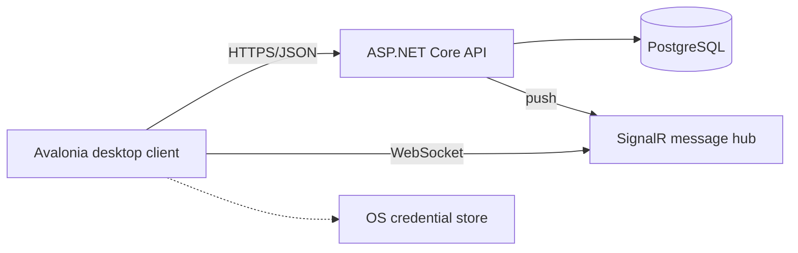

# Cryptie

A desktop instant messenger for one-to-one conversations, with message content encrypted on the sender's machine, built as an Avalonia client and an ASP.NET Core server over a shared class library.


## Overview

Every account holds an RSA-2048 key pair, generated on the client at registration as a self-signed X.509 certificate. A conversation has one AES key, wrapped separately under each participant's certificate. Message content is encrypted before it leaves the client, so the server routes and stores it without holding the conversation key.

Signing in takes three steps: a password, a time-based one-time code, and a six-digit PIN. The private key is kept on the server, encrypted on the client under a key derived from the PIN by SHA-256, and fetched and decrypted again at each sign-in. The PIN itself is never sent. A control value stored beside the key lets the client verify the PIN before it decrypts the key itself.

Built as coursework for a university course on defensive programming, on a self-chosen topic. Complete, with no further development planned.

## Scope

Cryptie covers registration with two-factor enrolment, contacts, one-to-one conversations, real-time delivery and message history, on a client and a server that were run on one machine.

Conversations are created as private two-person chats when a contact is added, and there is no way to add a third person to one. Message deletion, editing, attachments and read receipts are outside the scope. There is no deployment story beyond a local run, and the system has never had users beyond local testing.

## Features

- Registration with a login, a display name, an e-mail, a password and a six-digit PIN, generating the key pair on the client
- Mandatory two-factor authentication, with the server issuing a provisioning URI that the client renders as a QR code
- Private key held in the operating system credential store, split across entries with a metadata entry holding the count
- Contacts added by login name, which creates the conversation and establishes its key for both sides in one step
- Messages encrypted with the conversation key before they leave the client, with a fresh initialisation vector each time and a 2 000-character limit
- Real-time delivery over a WebSocket hub, message history on opening a conversation with a fallback retrieval path, and a conversation list ordered by most recent activity
- A waiting screen when the server is unreachable, retrying at one second, then ten, then thirty, and resuming when it answers
- Account lockout after repeated failed sign-ins, applied identically to logins that do not exist
- Authentication responses padded up to a 100 ms floor, and a token-bucket rate limiter partitioned per caller
- Password rules checked before submission, display name changes, a local sign-out that clears the machine, and default, light and dark themes

## Tech stack

C# on .NET 9, nullable reference types enabled in every project.

| Area | Libraries |
|---|---|
| Client | Avalonia UI 11.3 with ReactiveUI for MVVM and routing, the Semi theme, `Mapster`, `QRCoder`, `KeySharp` for the operating system credential store, the .NET X.509 and cryptographic message syntax APIs, the SignalR client with automatic reconnection |
| Server | ASP.NET Core 9 with attribute-routed controllers, SignalR over WebSockets, Entity Framework Core 9 with `Npgsql`, `BCrypt.Net-Next`, `Otp.NET`, `Docker.DotNet`, OpenAPI with a Scalar reference page in development |
| Shared | `FluentValidation`, twelve entities and forty-two request and response types |
| Data store | PostgreSQL, with the schema expressed through entities using explicit snake_case table and column names |
| Testing | The xUnit harness with `Moq`, `NSubstitute` and `FluentAssertions`, the Entity Framework Core in-memory provider, `coverlet` |

The client builds for `win-x64`, `linux-x64`, `osx-x64` and `osx-arm64`. The macOS targets publish as self-contained single-file builds, and a script assembles them into an application bundle. GitHub Actions runs a SonarCloud analysis on pushes to the main branch and on pull requests. There is no container image and no deployment workflow.

## Architecture

Two runnable programs over one shared library. The client never touches the database, and the only compile-time coupling between the two is the shared library.

| Project | Responsibility |
|---|---|
| `Cryptie.Client` | Avalonia desktop application. Views, view models, navigation, typed HTTP clients, all client-side cryptography |
| `Cryptie.Common` | Entities, request and response types, validation rules. Referenced by both sides |
| `Cryptie.Server` | Controllers, one service per feature area, a single data access service, the SignalR hub |
| `Cryptie.*.Tests` | One test project per source project |



**Layers.** Controllers are thin and delegate to one service per feature area. Those services share a single data access service that owns every query, over one Entity Framework Core context exposed to them as an interface. On the client, views bind to view models through compiled bindings, view models are resolved from a dependency injection container and located by a naming convention, and server access is split into eight typed HTTP clients pointed at one configured base address.

**Two channels.** Persistent operations and history go over HTTP as JSON. Live delivery goes over the hub, where a client joins a group named by the conversation identifier and the server pushes each stored message to that group. The connection reconnects automatically, and a background loop polls a health endpoint every five seconds so the shell can show a waiting screen and resume. The surface is 18 endpoints across six controllers plus three hub methods.

| Route | Purpose |
|---|---|
| `POST /auth/register` | Account creation, returns a provisioning URI and a two-factor token |
| `POST /auth/login` | Password check, returns a token valid for five minutes |
| `POST /auth/totp` | One-time code check, returns the session token |
| `GET /user/privateKey` | The encrypted private key and control value |
| `POST /user/addfriend` | Creates the conversation and stores one wrapped key per member |
| `POST /user/userdisplayname` | Display name change |
| `POST /group/groupsNames` | Conversation names, resolved to the other participant for private chats |
| `POST /messages/send` | Stores a message and broadcasts it over the hub |
| `GET /messages/get-all` | History for a conversation |
| `POST /messages/get-all-since` | History from a timestamp, used as the fallback path |
| `POST /status/server` | Liveness, polled by the client |

## Testing

422 test methods across 98 test files, run under xUnit with coverage collected in OpenCover format and reported to SonarCloud.

| Area | What they check |
|---|---|
| Client | View models, services, converters and the cryptographic helpers, over mocked dependencies |
| Shared | Entities, request and response types, and every validation rule |
| Server | Controllers and services over the in-memory provider and hand-written context doubles |

## Screenshots


## Project structure

```text
src/
  Cryptie.Client        Avalonia desktop application
  Cryptie.Common        entities, transfer objects and validators shared by both sides
  Cryptie.Server        ASP.NET Core API and SignalR hub
  Cryptie.*.Tests       one test project per source project
docs/screenshots        images of the running client
```

## Authors

**Kamil Fudala**

- [GitHub](https://github.com/FreakyF)
- [LinkedIn](https://www.linkedin.com/in/kamil-fudala/)

**Jan Chojnacki**

- [GitHub](https://github.com/Jan-Chojnacki)
- [LinkedIn](https://www.linkedin.com/in/jan-chojnacki-dev/)

**Jakub Babiarski**

- [GitHub](https://github.com/JakubKross)
- [LinkedIn](https://www.linkedin.com/in/jakub-babiarski-751611304/)

